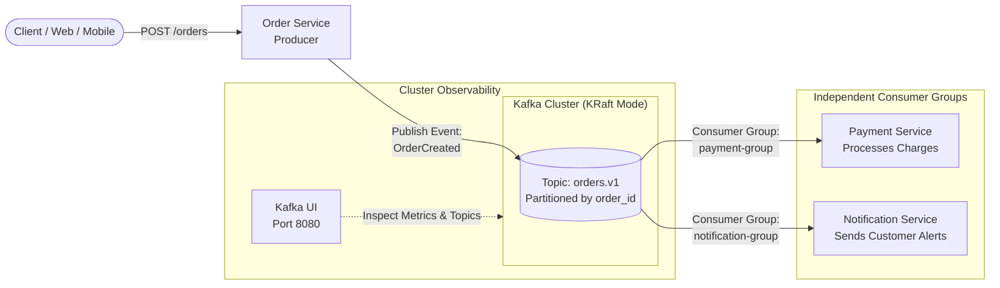

# Kafka Event-Driven Architecture: Order Processing PoC

[-black?logo=apachekafka)](https://kafka.apache.org/)
[](https://www.docker.com/)
[](https://github.com/provectus/kafka-ui)
[](https://opensource.org/licenses/MIT)

A production-grade Proof of Concept (PoC) demonstrating **Event-Driven Architecture (EDA)** using **Apache Kafka in KRaft mode (ZooKeeper-less)**.

This project implements the end-to-end lifecycle of an e-commerce order, inspired by the classic distributed systems engineering case study: *"Why every backend ends up using Kafka explained with one order"* ([TechWorld with Nana](https://www.youtube.com/watch?v=B7CwU_tNYIE)).

---

## 💡 The Problem It Solves

In traditional synchronous architectures (direct REST/HTTP calls), when a customer places an order:
1. The **Order Service** calls the **Payment Service** via HTTP.
2. It waits and then calls the **Inventory Service**.
3. It waits again and calls the **Notification / Email Service**.

### Pain Points of Synchronous Coupling:
* **Cumulative Latency:** The customer waits for the sum of all downstream service response times.
* **Cascading Failures:** If the notification or third-party email provider is down or slow, the entire checkout process fails or times out.
* **Rigid Extensibility:** Adding a new downstream subscriber (e.g., fraud detection, real-time analytics, ERP) requires modifying and redeploying the Order Service.

### The Event-Driven Solution with Kafka:
* **Instant Confirmation:** The `Order Service` validates the request, publishes an immutable `OrderCreated` event to the `orders.v1` topic, and immediately responds to the client with `202 Accepted` / `201 Created`.
* **Decoupled Subscribers:** Downstream services (`Payment Service`, `Notification Service`, etc.) consume events independently at their own pace using dedicated **Consumer Groups**.
* **Fault Tolerance:** If a consumer goes down, events remain safely persisted in the Kafka log. When the service recovers, it resumes processing exactly where it left off without message loss.

---

## 🏛️ System Architecture



---

## ⚙️ Kafka Core Concepts Demonstrated

* **KRaft Consensus:** Apache Kafka without ZooKeeper dependency, simplifying operational overhead and metadata management.
* **Consumer Groups:** Demonstrating independent offset tracking. Each group reads the stream concurrently without interfering with other consumers.
* **Partition Keys:** Messages are keyed by `order_id` / `customer_id` ensuring sequential consistency per entity across partitions.
* **Healthchecks & Resilience:** Automated container readiness checks ensuring consumers only connect once the broker is healthy.

---

## 🚀 Quickstart

### Prerequisites
* [Docker](https://docs.docker.com/get-docker/) & Docker Compose v2+ installed and running.
* `curl` or Postman for API requests.

### 1. Clone the repository
```bash
git clone https://github.com/josecarlosschz/kafka-poc.git
cd kafka-poc
```

### 2. Start the Kafka cluster & UI
```bash
docker compose up -d
```

### 3. Verify running services
Check container health:
```bash
docker compose ps
```

Access the **Kafka UI** in your browser at:
👉 **[http://localhost:8080](http://localhost:8080)**

Inspect:
- Cluster health & brokers
- Topics and partitions
- Consumer groups and lag
- Live message streams

### 4. Stop the cluster
```bash
docker compose down
```

---

## 🗺️ Project Roadmap

- [x] **Phase 1:** Core infrastructure setup with Docker Compose (Kafka KRaft + Kafka UI) & Git hygiene.
- [ ] **Phase 2:** Domain contracts & Event Schemas (`OrderCreated`, `PaymentProcessed`).
- [ ] **Phase 3:** Order Service (REST API Producer publishing to `orders.v1`).
- [ ] **Phase 4:** Payment Service (Consumer group processing transactions).
- [ ] **Phase 5:** Notification Service (Independent consumer group simulating alerts).
- [ ] **Phase 6:** Automated end-to-end load script & fault tolerance demonstration.

---

## 📄 License
This project is open source and available under the [MIT License](LICENSE).
