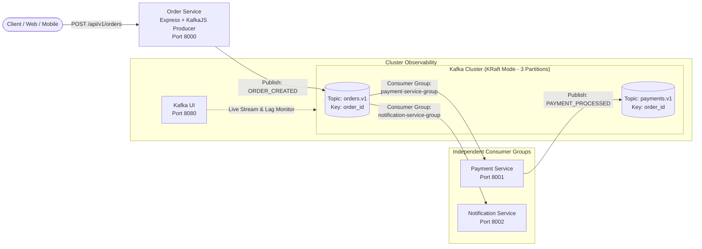

# Kafka Event-Driven Architecture: Order Processing PoC (Node.js + KafkaJS)

[](https://nodejs.org/)
[](https://kafka.js.org/)
[](https://expressjs.com/)
[-black?logo=apachekafka)](https://kafka.apache.org/)
[](https://www.docker.com/)
[](https://github.com/provectus/kafka-ui)
[](https://opensource.org/licenses/MIT)

A clean, production-grade Proof of Concept (PoC) demonstrating **Event-Driven Architecture (EDA)** using **Apache Kafka in KRaft mode (ZooKeeper-less)** with **Node.js (LTS v22)** and **KafkaJS**.

This project provides an ultra-readable, lightweight implementation of an asynchronous e-commerce order lifecycle, eliminating framework bloat while demonstrating core enterprise distributed systems patterns.

---

## 💡 The Problem It Solves

In traditional synchronous architectures (direct REST/HTTP calls), when a customer places an order:
1. The **Order Service** calls the **Payment Service** via HTTP.
2. It waits and then calls the **Inventory Service**.
3. It waits again and calls the **Notification Service**.

### Pain Points of Synchronous Coupling:
* **Cumulative Latency:** The customer waits for the sum of all downstream service response times.
* **Cascading Failures:** If notification or external APIs are down or slow, the entire checkout process fails or times out.
* **Rigid Extensibility:** Adding new subscribers requires modifying and redeploying the Order Service.

### The Event-Driven Solution with Kafka:
* **Instant Confirmation:** The `Order Service` validates the order, publishes an immutable `ORDER_CREATED` event to `orders.v1` keyed by `order_id`, and immediately responds to the client (`200 OK` with order & partition metadata).
* **Decoupled Subscribers:** Downstream services (`Payment Service`, `Notification Service`, etc.) consume events independently at their own pace via dedicated **Consumer Groups**.
* **Fault Tolerance:** If a consumer service goes down, messages remain safely stored in Kafka. Upon restart, the consumer picks up exactly where it left off without data loss.

---

## 🏛️ System Architecture



---

## 📦 Services Overview

| Service | Port | Role | Tech Stack | Kafka Topics |
| :--- | :--- | :--- | :--- | :--- |
| **Kafka Broker** | `9092`, `29092` | Event Streaming Platform (KRaft mode) | Confluent CP-Kafka 8.0.7 | `orders.v1`, `payments.v1` |
| **Kafka UI** | `8080` | Web Console & Stream Visualizer | Provectus Kafka-UI | All |
| **Order Service** | `8000` | REST API + Producer | Node.js 22, Express, KafkaJS | Produces to `orders.v1` |
| **Payment Service** | `8001` | Consumer (`payment-service-group`) & Producer | Node.js 22, Express, KafkaJS | Consumes `orders.v1`, Produces `payments.v1` |
| **Notification Service** | `8002` | Consumer (`notification-service-group`) | Node.js 22, Express, KafkaJS | Consumes `orders.v1` |

---

## 🚀 Quickstart

### 1. Start the entire ecosystem
```bash
docker compose up -d --build
```

### 2. Verify container health
```bash
docker compose ps
```
All containers should reach `healthy` status within seconds.

### 3. Send test orders
Execute the included automated test script:
```bash
sh scripts/send-test-orders.sh
```
This submits 6 orders with varying customers and amounts to test key-based partitioning.

### 4. Inspect live processing logs
```bash
docker compose logs -f payment-service notification-service
```

You will see:
* `payment-service` consuming each order, validating amount, and producing payment events to `payments.v1`.
* `notification-service` asynchronously receiving orders and dispatching simulated customer alerts.

### 5. Access Kafka UI
Open your browser at:
👉 **[http://localhost:8080](http://localhost:8080)**

Inspect:
- **Topics:** `orders.v1` and `payments.v1` (verify distribution across all 3 partitions).
- **Consumer Groups:** `payment-service-group` and `notification-service-group` (zero lag).
- **Messages:** View structured JSON envelopes and partition keys.

---

## 🧹 Cleaning Up

To stop all containers and clear persisted Kafka test data:
```bash
docker compose down -v
```

---

## 📄 License
This project is open source and available under the [MIT License](LICENSE).
